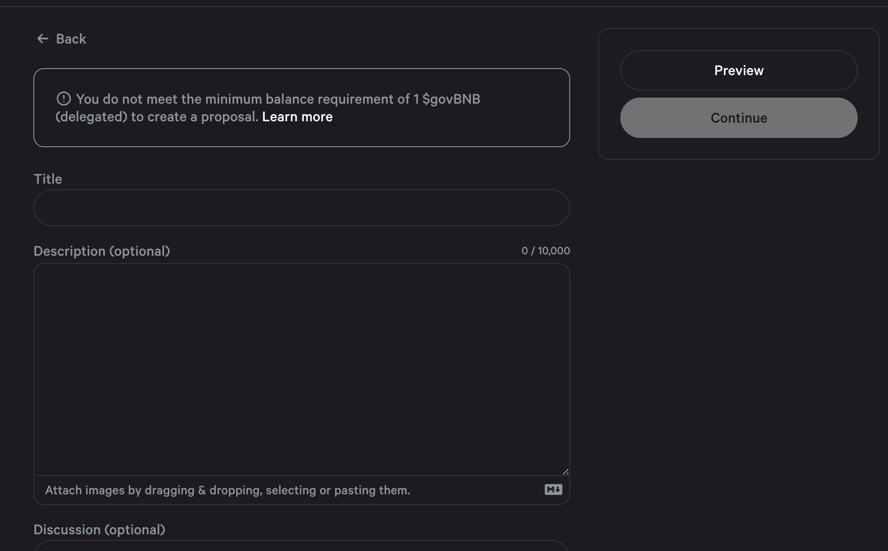
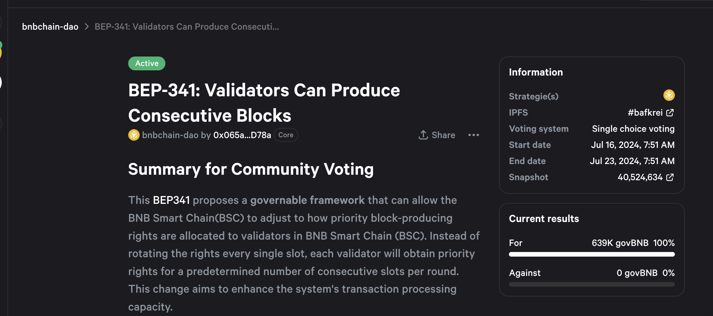
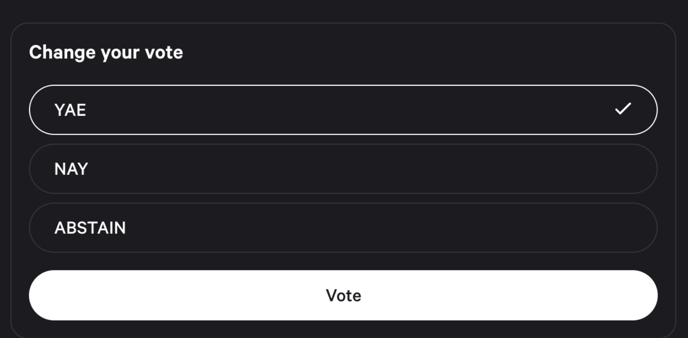
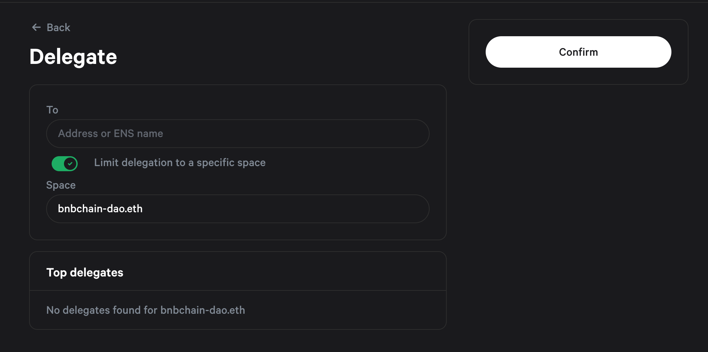

# Anubis Governance Temperature Check

## Overview

Anubis Chain governance involves a two-step process: temperature check and final decision voting. The temperature check, typically conducted through the Snapshot platform, allows any DAI holder to gauge community sentiment on a proposal. If the proposal receives enough support, it proceeds to the final decision voting phase. This phase often involves on-chain voting by validators or those with staked DAI, and the outcome determines whether the proposal is implemented or rejected.

## Submit a Proposal

!!! info
	Anyone who staked more than 1 DAI can create proposals.

Step 1: Head to the space which you wish to create your proposal for.

Connect with the wallet provider - make sure the connected wallet is where you delegate DAI

Step 2: Click New proposal in space sidebar

Fill in the following fields:
- Title
- Description
- Discussion link

Step 3: Select the desired voting system, specify the possible vote options, and define the duration of your proposal. Make sure you allow enough time for users to vote.

Step 4: Click `Publish` - and you can see your proposal in the proposals list on the space page.

## Voting

### Vote on a Proposal

!!! info
	All Anubis delegators can vote for proposals.

Step 1: Log in to the Anubis voting space on Snapshot.

Step 2: Go to the snapshot link of the proposal.

Step 3: Connect your wallet and vote

After you connect your wallet, make sure to use the same address of your DAI Staking. And choose the voting option.

### Delegate Voting Power

Step 1: Go to the Anubis delegate page on Snapshot.

Step 2: Enter the address you want to delegate to.

Step 3: Click Confirm to save your delegation.

### Undelegate Voting Power

Step 1: Go to the Anubis delegate page on Snapshot.

Step 2: Find the current delegatees in Top delegates.

Step 3: Click the 'x' button along a delegatee to undelegate, the wallet will ask user to sign and send transaction to Anubis.

### Factors Affecting Temperature Governance Power:
- DAI Holding Balance: The more DAI you hold, the greater your voting power.
- Staked DAI: Delegating your DAI to a validator also contributes to your governance power. This ensures those actively participating in the network's security have a say.

